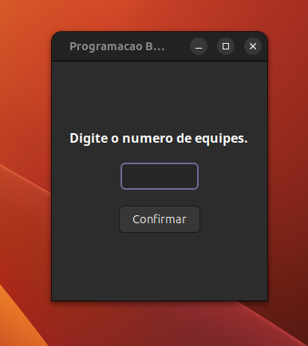

# Tabela para controle da pontuação da atividade em grupos do evento.

### Evento:         Faixa etária de 12 a 15 anos.

### Projeto:        Programação básica para todos.

### Data de criação: 09/05/2026.

## Etapas de funcionamento:

### Leitura de equipes:
Digite a quantidade de equipes que irá compor o evento e confirme.



### Leitura de atividades:

Digite nos devidos campos a Equipe e a Atividade.  

##### Identificador da equipe : ``` (n ∈ N | 1 <= n <= quantidade de equipes).```

#### Identificador da atividade :

- 0 -> Ajuda.
- 1 -> Conclusão de um exercício fácil.
- 2 -> Conclusão de um exercício médio.


## Como Compilar?

### Instalar o wxWidgets:

- Para instalar, digite no terminal: ``` sudo apt install libwxgtk3.2-dev ```
 
### Digite o comando no terminal: 
***NESSA ORDEM***

- Para compilar os arquivos : ``` make ```

- Para abrir a aplicação : ``` make run ```

## Sistemas Operacionais suportados:

- Linux

## AVISOS

### Abrir exclusivamente pelo terminal.

- ### Motivo:
    Aplicações gráficas que utilizam wxWidgets podem não ser exibidas corretamente no terminal integrado do VSCode. Recomenda-se utilizar um terminal externo para rodar a aplicação.


## Funcionalidades: 

- Ordenação automática das equipes por pontuação.

- Simplificação da contagem de pontos.

- Informação clara e organizada.
